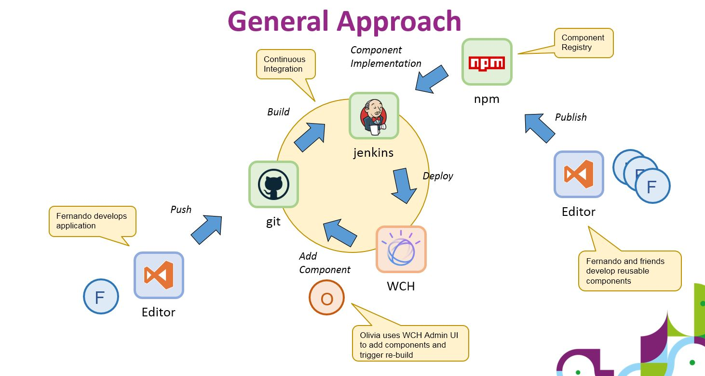

# Sample WCH SPA

This project serves as a shell for [WCH](https://www.ibm.com/products/watson-content-hub) demo applications. Initially it is an empty project, but it can be extended by adding [NPM](http://npmjs.com/) modules.

## Adding UI without having to install local Tools

In this section we discuss how to add UI components to this shell using the browser, only.

### Prerequisites

- Make sure to have access to a [WCH Tenant](https://www.ibm.com/products/watson-content-hub). You can subscribe for a [free trial](https://www.ibm.com/account/us-en/signup/register.html) if you don't have any, yet.
- After subscribing you will you have access to an [API URL](https://developer.ibm.com/customer-engagement/tutorials/getting-started-api-javascript/#tocstep1), your username and your password. You will need this information triplet later on.
- Register for a [GitHub](https://github.ibm.com/) account. You will need this to manage your version of the application.
- Register for a [Travis CI](https://travis.ibm.com) account. You will beed this to trigger the build and deployment step.

### Create your custom copy of the Application

The goal of this step is to create you custom version of the application in your [GitHub](https://github.ibm.com/) repository. This will serve as the baseline for all future customizations. The following steps need to be executed only once per application.

- Sign in to [GitHub](https://github.ibm.com/).
- Locate this project by searching for [DX-Samples/sample-wch-spa](https://github.ibm.com/DX-Samples/sample-wch-spa).
- Click on the [Fork](https://help.github.com/articles/fork-a-repo/) button in the upper right region of the page and select a target organization (if asked for).

#### Example

Replace `<YOUR_WCH_API_URL>` with the [API URL](https://developer.ibm.com/customer-engagement/tutorials/getting-started-api-javascript/#tocstep1). Make sure to keep the quotation marks. If either the value contains a quotation mark, you need to [escape](https://www.freeformatter.com/json-escape.html) it as `\"`.

```json
{
  "x-ibm-dx-tenant-base-url": "<YOUR_WCH_API_URL>"
}
```

For example, for the API URL `https://my13.digitalexperience.ibm.com/api/d1b9fd9b-402a-4cd0-9d60-c2d8e18db4d0` the file looks like:

```json
{
  "x-ibm-dx-tenant-base-url":
    "https://my13.digitalexperience.ibm.com/api/d1b9fd9b-402a-4cd0-9d60-c2d8e18db4d0"
}
```

### Setup the Deployment Process

The goal of this step is to deploy your application to your [WCH Tenant](https://www.ibm.com/products/watson-content-hub). We will make use of [Travis CI](https://travis.ibm.com) to execute this deployment automatically, whenever you add new UI components. The following steps need to be executed only once per application.

- Sign in to [Travis CI](https://travis.ibm.com).
- Accept the GitHub [access permissions confirmation](https://docs.travis-ci.com/user/github-oauth-scopes).
- If this is the first time you are using [Travis CI](https://travis.ibm.com) it will take a moment to synchronize your [GitHub](https://github.ibm.com/) repositories. You can also force this sync by clicking the `Sync Account` button.
- The UI displays a list of your repositories. Check the one that you have created in the previous step.
- Click on the project name to enter setting. Locate the `Environment Variables` section.
- Register your deployment credentials as environment variables. Enter both name and value, decide whether or not the property should be logged, then click on `Add`.
  - `ibm_wch_sdk_cli_username` your WCH username. This property can be visible.
  - `ibm_wch_sdk_cli_password` your WCH password. This property should be hidden.


### Trigger your first Deployment

Whenever you modify your application in [GitHub](https://github.ibm.com/), the commit of these modifications will trigger a deployment. We will trigger the first deployment by configuring the application to use the correct [WCH Tenant](https://www.ibm.com/products/watson-content-hub).

- Navigate to the [GitHub](https://github.ibm.com/) page of your forked application (make sure it's the forked application and not the original sample).
- Navigate to the `data` folder and click the file `.wchtoolsoptions.json`.
- Use the pencil icon to edit this file and replace the `username` with your [WCH](https://www.ibm.com/products/watson-content-hub) username and the `x-ibm-dx-tenant-base-url` with your [API URL](https://developer.ibm.com/customer-engagement/tutorials/getting-started-api-javascript/#tocstep1).
- Save your changes by hitting the `Commit Changes` button.

This will trigger the build and deployment process and can take a moment or two. You can monitor the process by navigating to your [Travis CI](https://travis.ibm.com) project on the `Build History` tab. Notice that the first time build will take longer than subsequent builds due to caching effects.


After a successful build you can access your application using the `Live URL` for your tenant.

#### Notice

After the first time deployment your application will just be the blank page, since we have not added any UI to the shell.

### Add custom UI Components

In order to display information in your application you need content and UI components that visualize the content. In this step we will add the UI components.

We assume that a developer has already designed and coded these components and that they are available as an [npm](http://npmjs.com/) module. In this section we will focus on how to add the components to your application using the [creative-bootstrap-components](https://www.npmjs.com/package/@dx-samples/creative-bootstrap-components) components as an **example**. In general refer to the documentation of your component library for further instructions.

- Identify the name of the [npm](http://npmjs.com/) UI module you would like to add. In our example this is [creative-bootstrap-components](https://www.npmjs.com/package/@dx-samples/creative-bootstrap-components). In some cases you might want to use a specific version of that module, let's use `^6.0.0` for our sample component.
- We will also deploy demo content as an example. For a non-demo site you don't want to do this and have your business users add the content. But for the demo case it's more convenient. Let's use [creative-bootstrap-content](https://www.npmjs.com/package/@dx-samples/creative-bootstrap-content) as the module that hosts the demo assets.
- Navigate to the [GitHub](https://github.ibm.com/) page of your forked application (make sure it's the forked application and not the original sample).
- Click the file `package.json` and use the pencil icon to edit this file.
- Append the new modules to the `dependencies` section:

```json
  "dependencies": {

    "@dx-samples/creative-bootstrap-components": "^6.0.0",
    "@dx-samples/creative-bootstrap-content": "^6.0.0"
  }
```

**Notice** the key/value format of the new entry and make sure to append the new entry with a comma `,` after the previous entry.

- Save your changes by hitting the `Commit Changes` button.
- Click the file `/src/app/app.module.ts` and use the pencil icon to edit this file.
- Make the following modification:
  - add the `import { WchNgBootstrapComponentsModule } from '@dx-samples/creative-bootstrap-components';` import statement.
  - add the imported `WchNgBootstrapComponentsModule` to the import section of the application.
- Save your changes by hitting the `Commit Changes` button.

```typescript
import { WchNgModule } from '@ibm-wch-sdk/ng';
import { environment } from '../environments/environment';
import { BrowserModule } from '@angular/platform-browser';
import { NgModule } from '@angular/core';

import { AppRoutingModule } from './app-routing.module';

import { AppComponent } from './app.component';

// modification start
import { BrowserAnimationsModule } from '@angular/platform-browser/animations';
import { WchNgEditModule } from '@ibm-wch-sdk/ng-edit';
import { WchNgBootstrapComponentsModule } from '@dx-samples/creative-bootstrap-components';
// modification end

@NgModule({
  declarations: [AppComponent],
  imports: [
    BrowserModule,
    AppRoutingModule,

    // modification start
    BrowserAnimationsModule,
    WchNgBootstrapComponentsModule,
    WchNgEditModule.forRoot(),
    // modification end

    WchNgModule.forRoot(environment)
  ],
  providers: []
  bootstrap: [AppComponent]
})
export class AppModule {}
```

After the [Travis CI](https://travis.ibm.com) build step completes, the new UI components will be available to your application (takes about 4mn).

### Next Steps

The process so far added UI components to the single page application running on top of [WCH](https://www.ibm.com/products/watson-content-hub), including the installation of the type definitions used by these components. However there is no out-of-the-box demo content installed, so the application would still show an empty page. In order to add demo content you can:

- Install predefined demo content from yet another module (TBD).
- Create your own content using the WCH Authoring UI.

### Development Process

The following chart gives an overview of the intended development and deployment process.

### Personae

- **Olivia** the business user. Olivia can create content on WCH and is also able to use Git and Travis UI. But she is not a coder.
- **Fernando** the developer. Fernando can create UI components, knows how to build [Angular](https://angular.io/) applications and can package and deploy components to [NPM](https://www.npmjs.com/).


